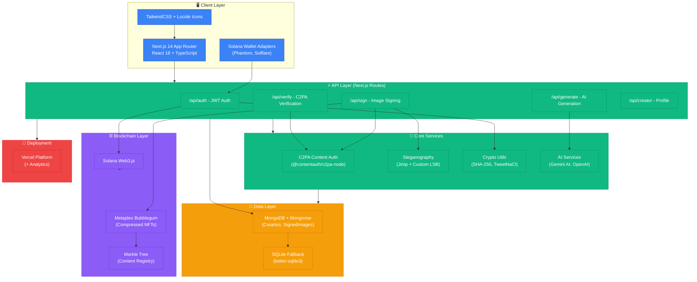

# Reclaim Tech Stack Architecture

## 📦 Technology Summary

### Frontend Stack
- **Framework:** Next.js 14 (App Router) + React 18
- **Styling:** TailwindCSS 4.0
- **Icons:** Lucide React
- **Wallet:** @solana/wallet-adapter-react

### Backend Stack
- **Runtime:** Next.js API Routes (Serverless)
- **Language:** TypeScript 5.9
- **Image Processing:** Jimp 1.1
- **Content Auth:** @contentauth/c2pa-node 0.5

### Database Stack
- **Primary:** MongoDB + Mongoose 9.1
- **Fallback:** better-sqlite3 11.0

### Blockchain Stack
- **Network:** Solana (Devnet/Mainnet)
- **Library:** @solana/web3.js 1.98
- **NFTs:** @metaplex-foundation/mpl-bubblegum 5.0
- **Type:** Compressed NFTs (cNFTs)

### AI Stack
- **Google:** @google/generative-ai (Gemini)
- **OpenAI:** openai 6.16

### Security & Auth
- **JWT:** jsonwebtoken 9.0
- **Crypto:** tweetnacl 1.0, bs58 6.0
- **Hashing:** Native SHA-256

### Deployment
- **Platform:** Vercel
- **Analytics:** @vercel/analytics 1.6

## 🔄 Data Flow

1. **User authenticates** via Solana wallet → JWT issued
2. **Content upload** → Image processed with C2PA + LSB steganography
3. **Sign & embed** → Watermark + content provenance data
4. **Mint cNFT** → Register on Solana via Merkle Tree
5. **Store metadata** → MongoDB records hash + creator ID
6. **Verification** → Extract watermark, validate C2PA, check blockchain

## 💡 Key Features
- **Dual Watermarking:** LSB steganography + C2PA standard
- **Blockchain Registry:** Compressed NFTs (cost-efficient)
- **Wallet-based Auth:** No passwords, crypto signatures
- **AI Integration:** Generate AI content with provenance

